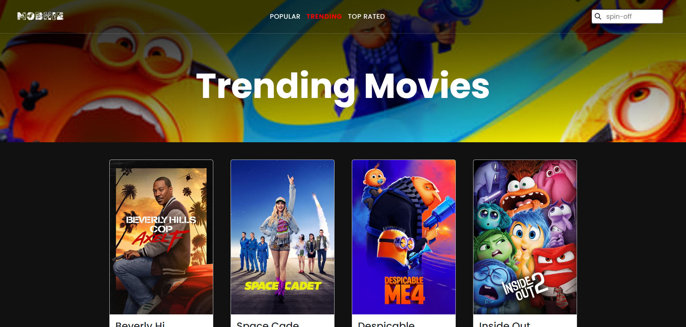

# MOBHIE
MOBHIE is a comprehensive movie box application that allows users to explore hundreds of movies across various categories, including Popular movies, trending movies, and more.

  

 

MOBHIE app provides a rich and engaging platform for movie enthusiasts to discover, search, and enjoy a wide array of films. Users can access detailed information about each movie, including ratings, descriptions, budgets, and more. With features such as search functionality and a randomizer for movie recommendations, MOBHIE ensures an enjoyable and seamless movie-browsing experience. The application is designed to be user-friendly and responsive across all devices, providing a consistent and smooth experience whether on a desktop, tablet, or mobile device.

Powered by the "The Movie Database" or <a href="https://www.themoviedb.org">TMDB</a> API, MOBHIE delivers accurate and up-to-date movie data, offering users an extensive database of films to explore. The integration of this API ensures that users have access to a vast collection of movies with comprehensive details and the latest information.

## Features
* Movie Browsing: Explore hundreds of movies across various categories, including Popular and trending movies, ensuring there's always something interesting to watch.
* Detailed Movie Information: Access in-depth details about each movie, including ratings, descriptions, budgets, and more, to make informed viewing choices.
* Search Functionality: Quickly find specific movies using the search feature, making it easy to locate your favorite films or discover new ones.
* Randomizer Feature: Get personalized movie recommendations with the randomizer feature, perfect for when you can't decide what to watch.
* User-Friendly Interface: Designed with simplicity in mind, the app ensures an intuitive and straightforward user experience, making movie discovery enjoyable and accessible.
* Responsive Design: Enjoy a seamless and consistent experience across all devices, from desktops to tablets and mobile phones.

## Have a visit

Please click <a target="blank" href="#">here</a> or manually visit mobhie.com .

## Technology Used
This section provides an overview of the key technologies and frameworks utilized in the development of the this app:

* Programming Languages: PHP, Javascript
* Integrated Development Environments: Visual Studio.
* Design and Prototyping Tool: Adobe XD and Photoshop.
* Other technologies: Bootstrap, Laravel, Font Awesome, TMDB API.

## Support or Contact
If you encounter any issues or have questions about the this app, please don't hesitate to reach out to me directly at wilhelmus.olejr@gmail.com. As the sole developer, I am dedicated to offering support and will do my best to respond to your queries and concerns promptly, aiming to provide solutions and enhance your app experience.

## Contributing
I welcome contributions of all kinds from the community. If you're interested in helping improve this app, please:
* Fork the repository and create your branch from `main`.
* Write clear code and add appropriate tests.
* Submit a pull request with comprehensive descriptions of changes.

## Screenshot

  
  
Randomizer Feature

 

  
  
List of Trending Movies

 

  
  
Movie Preview

